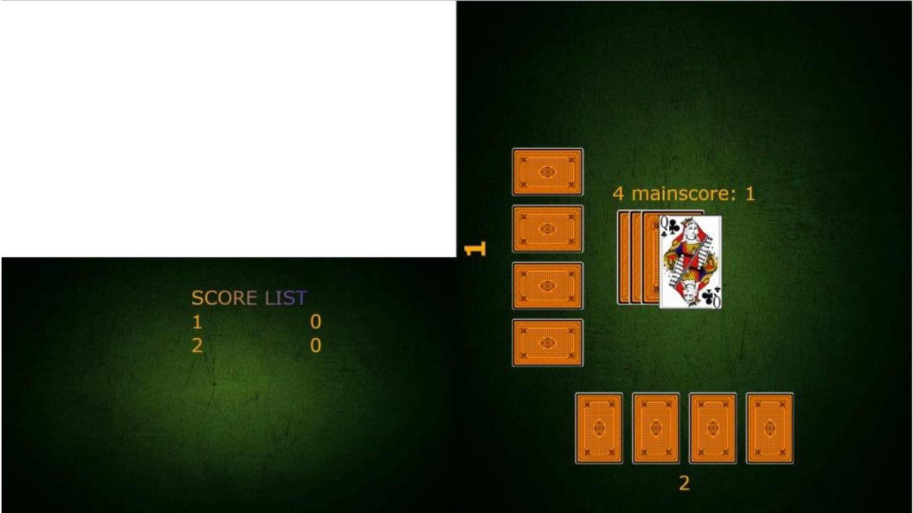
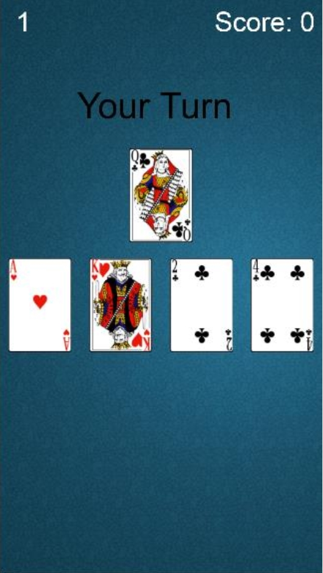

# Pishti Card Game
This project is developed for internship in Arçelik.

Pishti is a card game thas has very simple rules. Players start with 4 cards. Every turn, players try to put a card equal to the number on top of card deck on table. Joker takes every time. If there is only one card on the table, and player puts equal card then he gets pishti(extra point).

This game is developed for Arçelik TVs. Users can open new table and play in their televisions while they can watch channels in upper left corner on the tv. Other players can join by their cellphone.

For more detailed rules and history of the game you can look wiki page of the game. [Wiki](https://en.wikipedia.org/wiki/Bastra)

## Installation

To install npm packages:
```
npm install
```
## Usage

To start the server:
```
node pisti.js
```
Start a new table:
```
localhost:3000/table
```
To join a table by your phone:
```
localhost:3000/hand
```
## Screenshots
Table: 
Hand: 

## Contributors
* Mehmet Taha Çorbacıoğlu [Github](https://github.com/tahacorbaci)
* Cihat Erbay
* Kaya Yıldırım [Github](https://github.com/kyyldrm)

## License
This project is licensed under the MIT License - see the [LICENSE](LICENSE) file for details